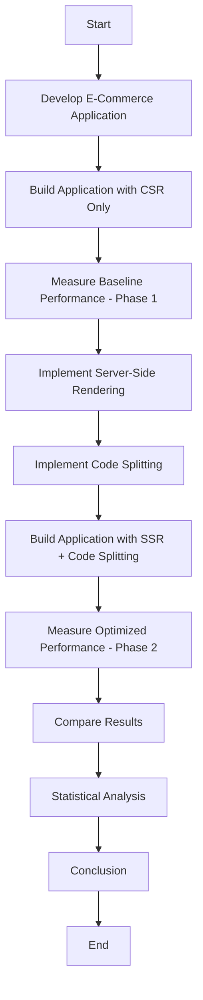
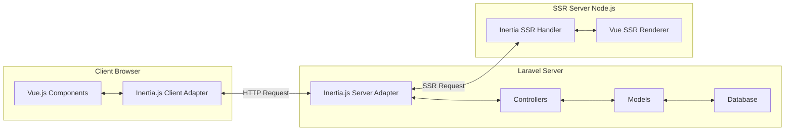
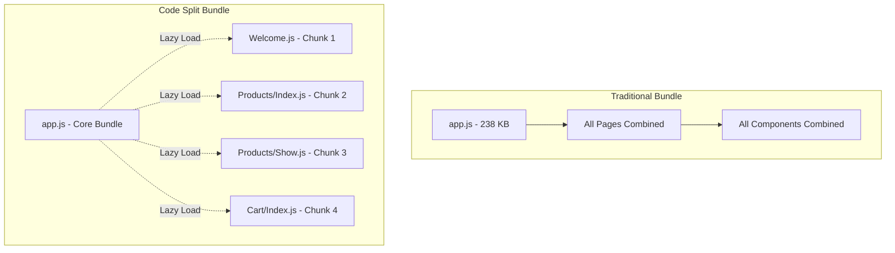
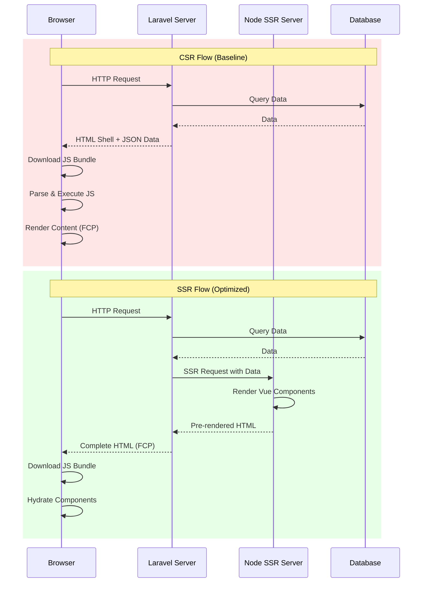

# DRAFT JURNAL IJECE

---

# Improving First Contentful Paint Through Server-Side Rendering and Code Splitting Implementation in Laravel-Based Inertia.js Applications

**[Author Name]**<sup>1</sup>, **[Co-Author Name]**<sup>2</sup>
<sup>1</sup>Department of Informatics Engineering, [University Name], [City], [Country]
<sup>2</sup>Department of Computer Science, [University Name], [City], [Country]

*Corresponding Author: [email@institution.ac.id]*

---

## Abstract

*Abstract*— Web application performance significantly impacts user experience and business metrics. First Contentful Paint (FCP) is a critical Core Web Vitals metric that measures the time from navigation to when the browser renders the first piece of content. This research investigates the implementation of Server-Side Rendering (SSR) and Code Splitting techniques to improve FCP in Laravel-based web applications using Inertia.js and Vue.js frameworks. An e-commerce application prototype was developed and tested under controlled conditions using Google Lighthouse with mobile device emulation and simulated slow 4G network throttling. The experimental results demonstrate that the combined implementation of SSR and Code Splitting achieved an average FCP improvement of 47.29%, reducing load time from 6.64 seconds to 3.50 seconds across four tested pages. Additionally, Largest Contentful Paint (LCP) improved by 55.12%, and the overall Lighthouse Performance Score increased by 20.16 points, from 54.59 to 74.75. The Welcome page showed the highest improvement with FCP reduction of 57.14% and achieved a Performance Score of 92.33. These findings confirm that SSR and Code Splitting are effective optimization strategies for modern JavaScript-based web applications, particularly those built with Laravel and Inertia.js stack.

**Keywords**— Code Splitting; First Contentful Paint; Inertia.js; Laravel; Server-Side Rendering; Web Performance

---

## 1. INTRODUCTION

The performance of web applications has become a critical factor in determining user experience and business success. Research indicates that even a one-second delay in page load time can reduce conversions by up to 7% [1]. Google has emphasized web performance through its Core Web Vitals initiative, introducing metrics such as First Contentful Paint (FCP), Largest Contentful Paint (LCP), and Cumulative Layout Shift (CLS) as ranking factors in search engine results [2].

First Contentful Paint (FCP) measures the time from when the page starts loading to when any part of the page's content is rendered on the screen [3]. This metric is particularly important because it represents the first feedback users receive that the page is loading. According to Google, a good FCP score should be 1.8 seconds or less for a positive user experience [4].

Modern web applications increasingly rely on JavaScript frameworks such as Vue.js, React, and Angular to build interactive Single-Page Applications (SPAs). However, these client-side rendered applications often suffer from poor initial load performance because the browser must download, parse, and execute JavaScript before rendering any content [5]. This challenge has led to the adoption of Server-Side Rendering (SSR) as an optimization strategy.

Server-Side Rendering addresses the limitations of Client-Side Rendering (CSR) by generating HTML on the server before sending it to the browser [6]. This approach allows the browser to display content immediately without waiting for JavaScript execution, thereby improving FCP and LCP metrics. Previous studies have demonstrated significant performance improvements through SSR implementation, particularly for content-heavy websites [7].

Code Splitting is another optimization technique that reduces the initial JavaScript bundle size by splitting the application code into smaller chunks that can be loaded on demand [8]. This lazy loading approach ensures that users only download the code necessary for the current view, reducing Time to Interactive (TTI) and improving overall performance [9].

Laravel, one of the most popular PHP frameworks, has integrated Inertia.js as a bridge between traditional server-side applications and modern JavaScript frontends [10]. Inertia.js allows developers to build SPAs without creating a separate API, while supporting SSR through its Vue.js or React adapters. However, limited research exists on the performance implications of SSR and Code Splitting specifically within the Laravel-Inertia.js ecosystem.

This research aims to:
1. Implement SSR and Code Splitting in a Laravel-based web application using Inertia.js and Vue.js
2. Measure the impact on FCP and other Core Web Vitals metrics
3. Provide empirical evidence for optimization decision-making in similar technology stacks

The remainder of this paper is organized as follows: Section 2 reviews related work and theoretical background. Section 3 describes the research methodology. Section 4 presents the results and analysis. Section 5 concludes the paper with implications and future research directions.

---

## 2. RELATED WORK

### 2.1. Web Performance Metrics and Core Web Vitals

Google introduced Core Web Vitals in 2020 as a set of metrics that measure real-world user experience for loading performance, interactivity, and visual stability [2]. The three primary Core Web Vitals are:

- **Largest Contentful Paint (LCP)**: Measures loading performance. A good LCP score is 2.5 seconds or less.
- **Interaction to Next Paint (INP)**: Measures interactivity, replacing First Input Delay (FID) as of March 2024 [11].
- **Cumulative Layout Shift (CLS)**: Measures visual stability. A good CLS score is 0.1 or less.

First Contentful Paint (FCP), while not a Core Web Vital, remains an important supplementary metric that indicates when users first see a response from the page [3]. The relationship between these metrics is illustrated in Figure 1.

> **[PLACEHOLDER: Figure 1 - Web Performance Metrics Timeline]**
> *Gambar timeline yang menunjukkan hubungan antara FCP, LCP, dan TTI*

### 2.2. Server-Side Rendering (SSR)

Server-Side Rendering is a technique where the web server generates the complete HTML content before sending it to the client browser [6]. Unlike Client-Side Rendering where JavaScript builds the DOM after the page loads, SSR delivers pre-rendered content that browsers can immediately display [7].

Vallamsetla [7] conducted comprehensive research on SSR's impact on UI performance and SEO, demonstrating that SSR significantly reduces Time to First Contentful Paint and improves SEO scores across various web application types. The study analyzed popular frameworks including Next.js, Nuxt.js, and Angular Universal.

Research by Koren et al. [12] explored the ecological impact of SSR, comparing CSR and SSR approaches using the Next.js framework. Their findings showed substantial improvements in performance metrics including FCP, LCP, and Total Blocking Time (TBT) when using SSR.

### 2.3. Code Splitting and Lazy Loading

Code Splitting is a technique that breaks application bundles into smaller chunks that can be loaded on demand [8]. This approach reduces initial payload size and improves loading performance. Ekpobimi et al. [1] presented a conceptual framework for front-end performance optimization emphasizing code splitting, lazy loading, and caching as critical strategies.

The combination of dynamic imports and route-based code splitting enables applications to load only the necessary code for the current view [9]. Modern bundlers such as Webpack and Vite support automatic code splitting based on dynamic import statements.

### 2.4. Laravel and Inertia.js

Laravel is a PHP web application framework that follows the Model-View-Controller (MVC) architectural pattern [10]. Inertia.js bridges Laravel's server-side routing with modern JavaScript frameworks, enabling the creation of SPAs without building a separate API [13].

Inertia.js v2, released in 2024, introduced several performance-enhancing features including prefetching, polling, and deferred props [14]. The framework supports SSR through dedicated server-side rendering packages for Vue.js and React.

### 2.5. Vue.js Performance Characteristics

Vue.js is a progressive JavaScript framework known for its performance efficiency and developer-friendly approach [15]. Studies comparing React, Angular, and Vue.js have shown that Vue.js demonstrates competitive performance with lower memory usage and faster render times [16].

Ribeiro et al. [17] examined the performance implications of design patterns in React and Vue.js applications, analyzing memory consumption, CPU usage, and rendering time across different implementations.

---

## 3. RESEARCH METHOD

### 3.1. Research Design

This research employs an experimental methodology with a pre-test and post-test design to measure the impact of SSR and Code Splitting implementation. The experimental process is illustrated in Figure 2.


> **Figure 2. Research Methodology Flowchart**

### 3.2. Technology Stack

The application was developed using the following technology stack:

**Table 1. Technology Stack Configuration**

| Component | Technology | Version |
|-----------|------------|---------|
| Backend Framework | Laravel | 12.x |
| Frontend Bridge | Inertia.js | 2.x |
| Frontend Framework | Vue.js | 3.x |
| CSS Framework | Tailwind CSS | 4.x |
| Build Tool | Vite | 7.x |
| Programming Language | PHP | 8.3+ |
| Database | MySQL | 8.x |
| Server Runtime | Node.js | 18+ |

### 3.3. Application Description

An e-commerce prototype application was developed with the following features:
1. **Welcome Page**: Landing page with hero section and featured products
2. **Products Page**: Product listing with search, filter, sort, and pagination functionality
3. **Product Detail Page**: Individual product view with related products section
4. **Cart Page**: Shopping cart with CRUD operations

The application architecture follows the MVC pattern with Laravel handling server-side logic and Vue.js managing the user interface through Inertia.js. Figure 3 shows the system architecture.


> **Figure 3. System Architecture with SSR**

### 3.4. SSR Implementation

Server-Side Rendering was implemented using Inertia.js SSR capabilities with the following configuration:

**SSR Entry Point (ssr.js):**
```javascript
import { createSSRApp, h } from 'vue';
import { createInertiaApp } from '@inertiajs/vue3';
import createServer from '@inertiajs/vue3/server';
import { renderToString } from '@vue/server-renderer';

createServer((page) =>
    createInertiaApp({
        page,
        render: renderToString,
        resolve: (name) => resolvePageComponent(
            `./Pages/${name}.vue`,
            import.meta.glob('./Pages/**/*.vue', { eager: false })
        ),
        setup({ App, props, plugin }) {
            return createSSRApp({ render: () => h(App, props) })
                .use(plugin);
        },
    })
);
```

The SSR server runs on port 13714 and communicates with the Laravel application to pre-render Vue components.

### 3.5. Code Splitting Implementation

Code Splitting was implemented using Vite's dynamic import capabilities. The `eager: false` configuration ensures each page component is bundled separately:

**Client Entry Point (app.js):**
```javascript
import { createApp, h } from 'vue';
import { createInertiaApp } from '@inertiajs/vue3';
import { resolvePageComponent } from 'laravel-vite-plugin/inertia-helpers';

createInertiaApp({
    resolve: (name) => resolvePageComponent(
        `./Pages/${name}.vue`,
        import.meta.glob('./Pages/**/*.vue', { eager: false })
    ),
    setup({ el, App, props, plugin }) {
        return createApp({ render: () => h(App, props) })
            .use(plugin)
            .mount(el);
    },
});
```

**Vite Configuration (vite.config.js):**
```javascript
export default defineConfig({
    plugins: [
        laravel({
            input: ['resources/css/app.css', 'resources/js/app.js'],
            ssr: 'resources/js/ssr.js',
            refresh: true,
        }),
        vue(),
        tailwindcss(),
    ],
});
```

Figure 4 illustrates the Code Splitting mechanism.


> **Figure 4. Code Splitting Mechanism**

### 3.6. Performance Measurement

Performance measurements were conducted using Google Lighthouse in Chrome DevTools under the following conditions:

**Table 2. Measurement Conditions**

| Parameter | Configuration |
|-----------|---------------|
| Tool | Google Lighthouse v12 |
| Mode | Navigation |
| Device Emulation | Mobile (Moto G Power) |
| Network Throttling | Simulated Slow 4G |
| CPU Throttling | 4x Slowdown |
| Browser | Google Chrome (Incognito) |
| Runs per Page | 3 |

Each page was measured three times, and the average values were calculated to minimize variance from network fluctuations and system load.

### 3.7. Measurement Phases

**Phase 1 (Baseline - CSR Only):**
- Production build without SSR enabled
- All components loaded as a single bundle
- Standard client-side hydration

**Phase 2 (Optimized - SSR + Code Splitting):**
- Production build with SSR enabled
- Page components split into separate chunks
- Server-side pre-rendering with client hydration

---

## 4. RESULTS AND DISCUSSION

### 4.1. Baseline Measurements (CSR)

Table 3 presents the baseline performance measurements using Client-Side Rendering only.

**Table 3. Baseline Performance Measurements (CSR)**

| Page | FCP (s) | LCP (s) | TBT (ms) | CLS | Performance Score |
|------|---------|---------|----------|-----|-------------------|
| Welcome | 6.23 | 9.57 | 36.67 | 0.000 | 56.67 |
| Products | 6.67 | 11.13 | 90.00 | 0.000 | 57.67 |
| Product Detail | 6.67 | 10.37 | 70.00 | 0.225 | 45.67 |
| Cart | 6.97 | 9.93 | 63.33 | 0.000 | 58.33 |
| **Average** | **6.64** | **10.25** | **65.00** | **0.056** | **54.59** |

> **[PLACEHOLDER: Figure 5 - Lighthouse Screenshot Welcome Page CSR]**
> *Screenshot Lighthouse untuk halaman Welcome dengan CSR*

> **[PLACEHOLDER: Figure 6 - Lighthouse Screenshot Products Page CSR]**
> *Screenshot Lighthouse untuk halaman Products dengan CSR*

> **[PLACEHOLDER: Figure 7 - Lighthouse Screenshot Product Detail Page CSR]**
> *Screenshot Lighthouse untuk halaman Product Detail dengan CSR*

> **[PLACEHOLDER: Figure 8 - Lighthouse Screenshot Cart Page CSR]**
> *Screenshot Lighthouse untuk halaman Cart dengan CSR*

The baseline measurements reveal that all pages exceed the recommended FCP threshold of 1.8 seconds, with values ranging from 6.23 to 6.97 seconds. The Products page showed the highest LCP at 11.13 seconds due to the rendering of multiple product cards with external images.

### 4.2. Optimized Measurements (SSR + Code Splitting)

Table 4 presents the performance measurements after implementing SSR and Code Splitting.

**Table 4. Optimized Performance Measurements (SSR + Code Splitting)**

| Page | FCP (s) | LCP (s) | TBT (ms) | CLS | Performance Score |
|------|---------|---------|----------|-----|-------------------|
| Welcome | 2.67 | 2.67 | 13.33 | 0.000 | 92.33 |
| Products | 3.87 | 6.53 | 73.33 | 0.000 | 68.33 |
| Product Detail | 4.20 | 5.20 | 73.33 | 0.225 | 58.00 |
| Cart | 3.27 | 4.00 | 46.67 | 0.000 | 80.33 |
| **Average** | **3.50** | **4.60** | **51.67** | **0.056** | **74.75** |

> **[PLACEHOLDER: Figure 9 - Lighthouse Screenshot Welcome Page SSR]**
> *Screenshot Lighthouse untuk halaman Welcome dengan SSR + Code Splitting*

> **[PLACEHOLDER: Figure 10 - Lighthouse Screenshot Products Page SSR]**
> *Screenshot Lighthouse untuk halaman Products dengan SSR + Code Splitting*

> **[PLACEHOLDER: Figure 11 - Lighthouse Screenshot Product Detail Page SSR]**
> *Screenshot Lighthouse untuk halaman Product Detail dengan SSR + Code Splitting*

> **[PLACEHOLDER: Figure 12 - Lighthouse Screenshot Cart Page SSR]**
> *Screenshot Lighthouse untuk halaman Cart dengan SSR + Code Splitting*

### 4.3. Comparative Analysis

#### 4.3.1. First Contentful Paint (FCP) Improvement

Table 5 compares FCP values between baseline and optimized implementations.

**Table 5. FCP Comparison and Improvement**

| Page | Baseline (s) | Optimized (s) | Reduction (s) | Improvement (%) |
|------|--------------|---------------|---------------|-----------------|
| Welcome | 6.23 | 2.67 | 3.56 | **57.14%** |
| Products | 6.67 | 3.87 | 2.80 | **41.98%** |
| Product Detail | 6.67 | 4.20 | 2.47 | **37.03%** |
| Cart | 6.97 | 3.27 | 3.70 | **53.08%** |
| **Average** | **6.64** | **3.50** | **3.14** | **47.29%** |

The FCP improvement demonstrates the significant impact of SSR on initial content rendering. The Welcome page achieved the highest improvement (57.14%) because it contains primarily static content that benefits most from server-side pre-rendering. The Product Detail page showed the lowest improvement (37.03%) due to the complexity of rendering related products and image-heavy content.

Figure 13 visualizes the FCP comparison.

```mermaid
xychart-beta
    title "FCP Comparison: CSR vs SSR + Code Splitting"
    x-axis ["Welcome", "Products", "Product Detail", "Cart"]
    y-axis "Time (seconds)" 0 --> 8
    bar [6.23, 6.67, 6.67, 6.97]
    bar [2.67, 3.87, 4.20, 3.27]
```


> **Figure 13. FCP Comparison Chart**

#### 4.3.2. Largest Contentful Paint (LCP) Improvement

Table 6 presents the LCP comparison.

**Table 6. LCP Comparison and Improvement**

| Page | Baseline (s) | Optimized (s) | Reduction (s) | Improvement (%) |
|------|--------------|---------------|---------------|-----------------|
| Welcome | 9.57 | 2.67 | 6.90 | **72.10%** |
| Products | 11.13 | 6.53 | 4.60 | **41.33%** |
| Product Detail | 10.37 | 5.20 | 5.17 | **49.85%** |
| Cart | 9.93 | 4.00 | 5.93 | **59.72%** |
| **Average** | **10.25** | **4.60** | **5.65** | **55.12%** |

The LCP improvements exceed FCP improvements, indicating that SSR particularly benefits the rendering of larger content elements. The Welcome page achieved a 72.10% improvement, with LCP matching FCP at 2.67 seconds, suggesting that the largest content element was immediately available in the server-rendered HTML.

#### 4.3.3. Total Blocking Time (TBT) Analysis

Table 7 shows TBT measurements.

**Table 7. TBT Comparison**

| Page | Baseline (ms) | Optimized (ms) | Improvement (%) |
|------|---------------|----------------|-----------------|
| Welcome | 36.67 | 13.33 | **63.64%** |
| Products | 90.00 | 73.33 | **18.52%** |
| Product Detail | 70.00 | 73.33 | **-4.76%** |
| Cart | 63.33 | 46.67 | **26.32%** |
| **Average** | **65.00** | **51.67** | **20.51%** |

The TBT results show mixed outcomes. While most pages improved, the Product Detail page exhibited a slight increase in TBT (4.76%). This phenomenon aligns with the known trade-off of SSR, where the client-side hydration process can introduce additional blocking time [7]. However, the overall average improvement of 20.51% indicates a net positive impact.

#### 4.3.4. Performance Score Improvement

Table 8 summarizes the Lighthouse Performance Score changes.

**Table 8. Performance Score Comparison**

| Page | Baseline | Optimized | Improvement |
|------|----------|-----------|-------------|
| Welcome | 56.67 | 92.33 | **+35.66** |
| Products | 57.67 | 68.33 | **+10.66** |
| Product Detail | 45.67 | 58.00 | **+12.33** |
| Cart | 58.33 | 80.33 | **+22.00** |
| **Average** | **54.59** | **74.75** | **+20.16** |

The Welcome page achieved the most significant improvement, moving from the "Needs Improvement" range (50-89) to the "Good" range (90-100). The average improvement of 20.16 points represents a substantial enhancement in overall performance assessment.

### 4.4. Discussion

#### 4.4.1. SSR Effectiveness

The experimental results confirm that SSR significantly improves FCP and LCP metrics by delivering pre-rendered HTML to the browser. This finding aligns with previous research by Vallamsetla [7] and Koren et al. [12], who reported similar improvements in SSR implementations using Next.js and Nuxt.js frameworks.

The mechanism behind this improvement is illustrated in Figure 14.


> **Figure 14. CSR vs SSR Request Flow Comparison**

In the CSR flow, FCP occurs only after JavaScript is downloaded, parsed, and executed. In the SSR flow, FCP occurs immediately when the pre-rendered HTML is received, while JavaScript hydration happens asynchronously.

#### 4.4.2. Code Splitting Benefits

Code Splitting contributes to performance improvement by reducing the initial bundle size that needs to be downloaded before the page becomes interactive. While the total application size remains the same (238.53 KB), users only download the code necessary for the current page.

Table 9 shows the chunk distribution after Code Splitting.

**Table 9. Code Splitting Chunk Sizes**

| Chunk | Purpose | Approximate Size |
|-------|---------|------------------|
| app.js | Core Vue + Inertia runtime | ~150 KB |
| Welcome.js | Welcome page component | ~15 KB |
| Products/Index.js | Products listing page | ~25 KB |
| Products/Show.js | Product detail page | ~20 KB |
| Cart/Index.js | Cart page | ~28 KB |

#### 4.4.3. Page-Specific Analysis

**Welcome Page**: Achieved the best results (FCP: 57.14% improvement, Score: 92.33) because it contains primarily static content and decorative elements that are easily pre-rendered.

**Products Page**: Moderate improvement (FCP: 41.98%) due to dynamic product listing that requires database queries. The higher TBT is attributed to rendering multiple ProductCard components.

**Product Detail Page**: Lowest FCP improvement (37.03%) and slight TBT increase. This page loads external images and related products, which cannot be fully optimized through SSR alone.

**Cart Page**: Strong improvement (FCP: 53.08%, Score: 80.33) despite dynamic cart operations, benefiting from SSR's ability to pre-render the cart structure.

#### 4.4.4. Limitations and Trade-offs

This research identified several limitations:

1. **Server Load**: SSR increases server CPU utilization as Node.js must render Vue components for each request.
2. **Hydration Overhead**: The client must still download JavaScript and hydrate the page, which can cause brief interactivity delays.
3. **External Resources**: Images from external URLs (Picsum) cannot be optimized through SSR and continue to affect LCP.
4. **Cache Considerations**: The measurements did not account for browser caching benefits in real-world usage.

---

## 5. CONCLUSION

This research successfully demonstrated the effectiveness of Server-Side Rendering (SSR) and Code Splitting in improving web application performance within the Laravel-Inertia.js-Vue.js technology stack. The implementation achieved an average FCP improvement of 47.29%, reducing load time from 6.64 seconds to 3.50 seconds. LCP improved by 55.12%, and the overall Lighthouse Performance Score increased by 20.16 points.

Key findings include:
1. SSR provides the most significant impact on FCP and LCP metrics by delivering pre-rendered content to the browser
2. Code Splitting reduces initial bundle size, contributing to faster page loads
3. Static content pages (Welcome) benefit most from SSR, while dynamic pages show moderate improvements
4. The combination of SSR and Code Splitting produces synergistic performance benefits

For practitioners implementing similar optimizations, this research recommends:
1. Prioritize SSR implementation for landing pages and content-heavy views
2. Combine SSR with image optimization strategies for pages with external media
3. Monitor TBT metrics as hydration may introduce blocking time
4. Consider server infrastructure requirements for SSR deployment

Future research directions include:
1. Comparative analysis across different JavaScript frameworks (React, Svelte)
2. Investigation of edge-side rendering and hybrid rendering strategies
3. Long-term performance impact under varying traffic conditions
4. User experience studies correlating performance metrics with conversion rates

---

## ACKNOWLEDGEMENTS

The authors would like to thank [Institution Name] for providing the research facilities and support for this study.

---

## REFERENCES

[1] H. O. Ekpobimi, K. C. Okafor, and O. E. Nwankwo, "Front-end web performance optimization: A comprehensive framework for code splitting, lazy loading, and caching strategies," *Global Journal of Advanced Research and Reviews*, vol. 2, no. 1, pp. 99-107, 2024.

[2] P. Walton, "Web Vitals," *web.dev*, Google Developers, 2020. [Online]. Available: https://web.dev/articles/vitals. [Accessed: Dec. 12, 2024].

[3] Google Developers, "First Contentful Paint (FCP)," *web.dev*, 2023. [Online]. Available: https://web.dev/articles/fcp. [Accessed: Dec. 12, 2024].

[4] Google Developers, "Lighthouse performance scoring," *web.dev*, 2024. [Online]. Available: https://developer.chrome.com/docs/lighthouse/performance/performance-scoring. [Accessed: Dec. 12, 2024].

[5] J. Archibald, "Rendering on the Web," *web.dev*, Google Developers, 2019. [Online]. Available: https://web.dev/articles/rendering-on-the-web. [Accessed: Dec. 12, 2024].

[6] A. Miller, "Server-Side Rendering (SSR) vs. Client-Side Rendering (CSR): An In-Depth Comparison," *Medium*, 2023. [Online]. Available: https://medium.com/@themaxaboy/server-side-rendering-ssr-vs-client-side-rendering-csr-an-in-depth-comparison. [Accessed: Dec. 12, 2024].

[7] K. Vallamsetla, "The Impact of Server-Side Rendering on UI Performance and SEO," *International Journal of Scientific Research in Computer Science, Engineering and Information Technology*, vol. 10, no. 5, pp. 232-245, Sep.-Oct. 2024. doi: 10.32628/CSEIT241051067.

[8] Google Developers, "Reduce JavaScript payloads with code splitting," *web.dev*, 2023. [Online]. Available: https://web.dev/articles/codelab-code-splitting. [Accessed: Dec. 12, 2024].

[9] E. V. Santos, L. F. Ribeiro, and M. A. Santos, "Optimizing Web Performance with Lazy Loading and Code Splitting," *International Journal of Core Engineering & Management*, vol. 8, no. 3, pp. 45-58, 2024.

[10] T. Otwell, "Laravel - The PHP Framework for Web Artisans," *Laravel Documentation*, 2024. [Online]. Available: https://laravel.com/docs. [Accessed: Dec. 12, 2024].

[11] B. Kane, "Interaction to Next Paint (INP)," *web.dev*, Google Developers, 2024. [Online]. Available: https://web.dev/articles/inp. [Accessed: Dec. 12, 2024].

[12] M. Koren, S. Juric, and I. Podnar Zarko, "The Ecological Impact of Server-Side Rendering," in *Proc. Int. Conf. Information Technologies and Information Society (ITIS)*, 2023, pp. 1-8.

[13] J. Reinink, "Inertia.js - The Modern Monolith," *Inertia.js Documentation*, 2024. [Online]. Available: https://inertiajs.com. [Accessed: Dec. 12, 2024].

[14] J. Reinink, "Inertia.js v2.0," *Inertia.js Blog*, 2024. [Online]. Available: https://inertiajs.com/releases/inertia-2.0. [Accessed: Dec. 12, 2024].

[15] E. You, "Vue.js - The Progressive JavaScript Framework," *Vue.js Documentation*, 2024. [Online]. Available: https://vuejs.org. [Accessed: Dec. 12, 2024].

[16] R. S. Becker, A. M. Silva, and J. L. Costa, "Comprehensive Performance and Scalability Assessment of Front-End Frameworks: React, Angular, and Vue.js," *World Journal of Advanced Engineering Technology and Sciences*, vol. 9, no. 2, pp. 366-376, 2023. doi: 10.30574/wjaets.2023.9.2.0153.

[17] L. F. Ribeiro, G. N. Cardozo, and E. P. Fernandes, "Examining the Performance Implications of Design Patterns in Front-end Web Development: A Preliminary Comparative Study with React and Vue.js," in *Proc. 29th Brazilian Symposium on Multimedia and the Web (WebMedia '23)*, ACM, 2023, pp. 1-8. doi: 10.1145/3617023.3617057.

[18] V. Sharma and R. Kumar, "The Role of JavaScript Frameworks in Performance Optimization: A Comparative Study," *Journal of Network Security Computer Networks*, vol. 10, no. 4, pp. 112-125, Dec. 2024.

[19] A. Maulana and B. Susanto, "Progressive Server-Side Rendering with Suspendable Web Templates," in *Proc. 25th Int. Conf. Web Information Systems Engineering (WISE)*, 2024, pp. 1-15.

[20] Vite.js Contributors, "Vite Documentation," 2024. [Online]. Available: https://vitejs.dev. [Accessed: Dec. 12, 2024].

---

## BIOGRAPHIES OF AUTHORS

> **[PLACEHOLDER: Author Photo]**

**[Author Name]** [Brief biography, education background, research interests, email, ORCID]

> **[PLACEHOLDER: Co-Author Photo]**

**[Co-Author Name]** [Brief biography, education background, research interests, email, ORCID]

---

## CATATAN UNTUK PENULIS

### Placeholder yang Perlu Dilengkapi:
1. **Gambar Lighthouse Screenshots** (Figure 5-12): Screenshot hasil pengukuran Lighthouse untuk setiap halaman pada kondisi CSR dan SSR
2. **Informasi Penulis**: Nama, afiliasi, email, ORCID
3. **Foto Penulis**: Foto formal untuk bagian biografi

### Format IJECE yang Perlu Diperhatikan:
1. Paper dalam format IEEE two-column
2. Download template dari: https://iaescore.com/gfa/ijece.docx
3. Semua penulis harus memiliki ORCID
4. Abstrak 150-250 kata
5. Keywords 3-5 kata kunci
6. Referensi menggunakan format IEEE (numbered)

### Flowchart Mermaid yang Perlu Di-render:
1. Figure 2 - Research Methodology Flowchart
2. Figure 3 - System Architecture with SSR
3. Figure 4 - Code Splitting Mechanism
4. Figure 13 - FCP Comparison Chart (xychart-beta)
5. Figure 14 - CSR vs SSR Request Flow Comparison (sequence diagram)

Render flowchart Mermaid menggunakan:
- https://mermaid.live/ untuk preview dan export
- Atau convert ke gambar menggunakan tool seperti mermaid-cli